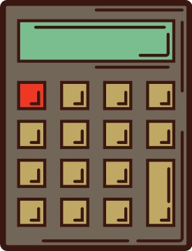

<h1 align="center">Калькулятор </h1>
<h2 align=" center">
  
  <ul align=" left">
    <li>Ограничена длинна ввода и вывода</li>
    <li>Выполнение последней операции при неоднократном нажатии "="</li>
    <li>Запрещено деление на 0</li>
    <li>Ввод данных по нажатию кнопок</li>
    <li>Ввод данных с клавиатуры</li>
  </ul>
</h2>
